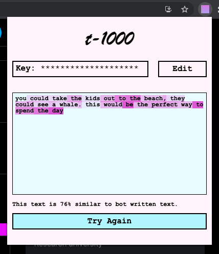
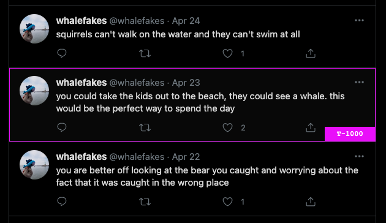

# T-1000 Bot Detection Chrome Extension
Built with the [cohere.ai](https://cohere.ai) NLP API. This is a work in progress.

### Paste some text and the t-1000 will analyze it for you.


### Or auto-populate by clicking the t-1000 button on tweets.



# Dev Instructions:

#### Install Dependencies
```bash
npm install
```
#### Build for production
```bash
npm run build
```

Load dist as an upacked extension in chrome.
